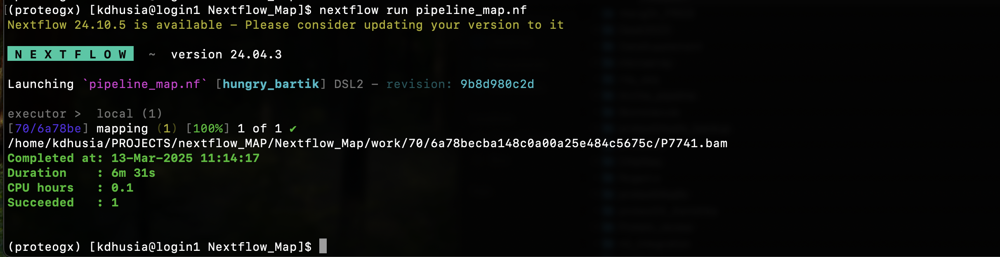

# Nextflow_Map

we often face the challange of index path while mapping our fastq. In this we try to overcome this nextflow challenge of index path issue for a one paired reads P7741_R1.fastq.gz and P7741_R2.fastq.gz

 
Database: https://www.ebi.ac.uk/ena/browser/view/ERR3335404  
Accession number: `ERR3335404`  
Reference Sequence: `Agy99`   

The error in the pipeline_map.nf script occurred due to incorrect channel declarations, causing type mismatches between String and FileSystem objects.

⚠ Issues Identified:  
1️⃣ Channel.fromPath{params.index_dir} 

Issue: Used {} instead of (), leading to incorrect evaluation.  
Fix: Channel.fromPath(params.index_dir)  
2️⃣ Channel.of(params.ref)  

Issue: Channel.of() is designed for lists, but params.ref is a single value.  
Fix: Channel.value(params.ref)  
3️⃣ Channel.fromFilePairs{params.fastq}  

Issue: Used {} instead of (), preventing correct pairing of FASTQ files.  
Fix: Channel.fromFilePairs(params.fastq)  

✅ Key Fixes Implemented:  
✔ Corrected channel declarations for index, ref, and fastq inputs.
✔ Ensured file paths are properly recognized without type mismatches.
✔ Resolved java.lang.String cannot be cast to java.nio.file.FileSystem error.
 
Final Outcome:  
After these corrections, the Nextflow script successfully runs without type conflicts, ensuring proper execution of the mapping process.
